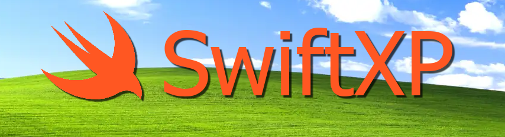
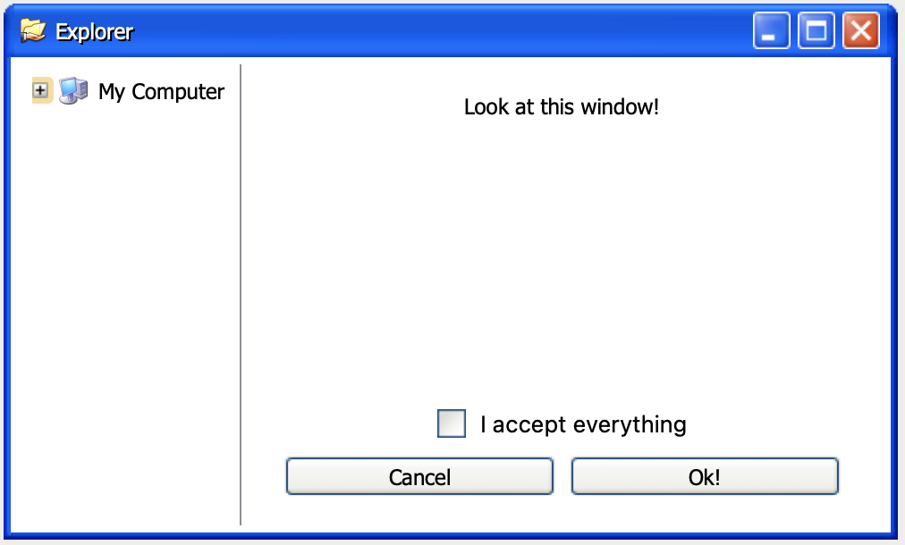

# SwiftXP



SwiftUI in style. Install as package in all your projects. 
Your clients will be so happy, they'll become your friends.

## What's included?
What's _not_ included?!   
 * `xpFont()`, for giving every Text() that sweet sentimental feeling of Tahoma.
 * `XPWindow(title: String, xpIcon: XPIcon) { }` A whole window!
 * `XPIcon`. An enum with a many, many icons!
 * `XPIconView`. Extremely easy to use view for icons  
 * `XPButtonStye()`! For using with `.buttonStyle()`
 * `XPSmallExplorer()`. A file explorer view, as in the example.

## Compatibility 
Works on MacOS, iOS probably. 
Use at your own risk. 
Live dangerously.

## Example
Want to make a window like this?


Type this Xcode: 
```Swift
import SwiftUI
import SwiftXP

public struct ContentView: View {
	
	@State var isOn: Bool = false
	@State var selectedFilename: String = ""
	
	public var body: some View {
		
		XPWindow(title: "Explorer", xpIcon: .folderHand) {
			HStack(alignment: .top) {
				XPSmallExplorer()
				
				XPVerticalSeparator()
				
				VStack {
					Text("Look at this window!")
						.xpFont()
					
						
					Spacer()
						Toggle("Checkbox!", isOn: $isOn)
							.toggleStyle(XPToggleStyle())
					
					HStack {
						Button("Cancel") {}
							.buttonStyle(XPButtonStye())
						
						Spacer()
						
						Button("Ok!") {}
							.buttonStyle(XPButtonStye())
					}
				}
				.padding()
			}
		}
	}
}
```

(I do not own Windows XP. Obviously. I made this for fun. Please don't sue me.)

## Now do Vista!
Nah.
